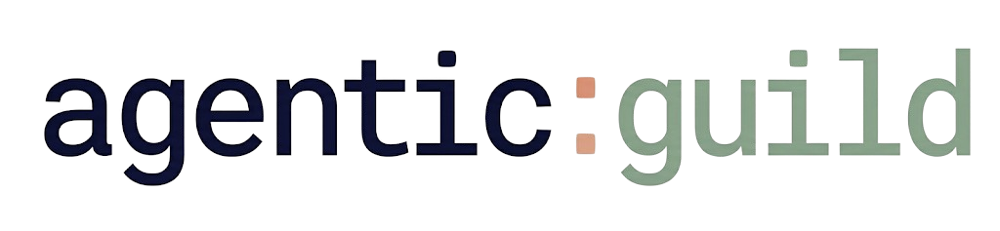

<picture>
  <source media="(prefers-color-scheme: dark)" srcset="assets/logo-white-bg.png">
  
</picture>

# Engineering-Grade AI Development

[](https://github.com/jdugarte/agentic-guild)
[](LICENSE)

> *Stop vibe coding. Start engineering.*

agentic:guild is a meta-framework that turns your AI coding assistant into a **disciplined software engineer** — one that follows the strict practices, processes, and documentation standards we've always known mattered, but rarely enforced.

---

## The problem with AI-assisted development today

Left to their own devices, AI coding assistants are **eager completion engines**. They will:

- Jump to solutions before understanding the problem
- Silently bypass architecture boundaries they don't know about
- Forget everything you agreed on three conversations ago
- Generate code that *looks* right but violates your own rules

The result is **vibe coding** — fast, messy, inconsistent, and increasingly difficult to maintain. You get output, but not engineering.

---

## What agentic:guild does

agentic:guild injects a **software engineering operating system** into your project. It gives your AI agent:

- 📋 **A process to follow** — step-by-step workflows it cannot skip or shortcut
- 🧠 **A memory** — a git-ignored local state it uses to resume tasks exactly where they left off
- 📐 **A constitution** — architecture and spec documents it must consult and obey before touching your code
- 🚦 **Hard stops** — mandatory human approval gates before any destructive or irreversible action
- 🔍 **A code review standard** — not stylistic suggestions, but numbered, actionable, engineering-grade feedback

The AI doesn't just help you type faster. It **becomes a team member with a job description**.

---

## The process is the product

Most tools optimize for output. agentic:guild optimizes for the **process that generates output**.

Code is not the end goal — it's a byproduct. What actually matters is whether the decisions that produced it were sound: whether requirements were understood, architecture was respected, trade-offs were considered, and the reasoning was documented for the next developer — human or AI — who has to work with it. As the engineers who built the Space Shuttle's flight software put it: [the most important creation is not the software — it's the process that produces it](https://david-haber.github.io/posts/the-right-stuff/).

But here's what makes agentic:guild different from a static rulebook: **the process improves as the project grows.**

Every time a task completes, agentic:guild's `harvest-rules` skill scans what was actually built — the Git diff, the solutions that emerged, the patterns that held up — and evaluates them against your existing standards. Where they represent genuine new knowledge, it proposes additions to your living architecture documents. The rules that guide tomorrow's decisions are informed by the experience of today's.

The result is a system that doesn't just enforce good practices. It **accumulates them** — each task raising the baseline for the next, generating certainty rather than just output.

---

## Who is this for?

agentic:guild is for developers and technical leads who:

- Are tired of AI assistants that confidently do the wrong thing
- Want their AI to reason about architecture, not just autocomplete
- Are building something complex enough that documentation, traceability, and standards actually matter
- Want to delegate entire development tasks to an AI — with confidence the output will hold up to review

If you've ever thought *"I need this AI to follow the same rules my team follows"* — that's exactly what agentic:guild is for.

---

## How it transforms your workflow

### Before agentic:guild
- You describe a feature, the AI codes it, you review, it breaks something, you fix it, repeat.
- Documentation drifts from reality.
- Architecture rules exist in your head, not in your project.
- Every new conversation starts from scratch.

### After agentic:guild
- **It actively intercepts vibe coding**, catching unstructured requests (e.g., "build a login page") and redirecting you to the proper planning process.
- The AI **classifies** every task before it touches anything.
- It **writes a traceable implementation plan** you approve before the first line of code changes.
- It uses **Test-Driven Development** by default, enforced by a Correct-by-Construction gate.
- It **audits its own output** against your architectural standards before delivering it.
- It **never commits or pushes** without your explicit instruction.
- Every requirement gets a **REQ-ID traceability tag** (`REQ-AUTH-001`), creating an audit trail from spec to code.
- Your documentation **stays in sync** with your code, automatically.

---

## The core skills (what your AI can now do)

Once agentic:guild is installed, your AI assistant gains a suite of structured, stateful workflows:

| Skill | What It Does |
|---|---|
| `start-task` | Full task lifecycle: classify → plan → TDD loop → CbC gate. Never starts coding without a plan you've approved. |
| `explore-task` | Deep discovery for new features or ambiguous work. Explores options, surfaces trade-offs, and documents findings before any commitment. |
| `finish-branch` | Runs local code review, HRE compliance audit, and prepares a structured PR — in sequence, with gates between each phase. |
| `code-review` | Project-aware static analysis that produces numbered, actionable fixes — not generic advice. |
| `audit-compliance` | An independent verification pass. Checks code determinism, REQ-ID traceability, and HRE compliance mathematically. |
| `status-check` | The GPS. Reads persistent memory to diagnose exactly where a task is blocked and fully rehydrates context. |
| `harvest-rules` | Scans Git diffs to extract new architectural patterns and maps them to living documentation. The AI learns from its own work — rules improve as the project grows. |
| `sync-docs` | Keeps SPEC, DATA_FLOW_MAP, ADRs, and schema references synchronized with every branch change. |
| `roadmap-manage` | Add, prioritize, and track features and bugs in a structured `ROADMAP.md`. |
| `pr-description` | Generates a complete, Git-history-based PR description for you to review and submit. |

---

## Getting Started

agentic:guild syncs into any existing or new project in seconds.

### 1. Run the sync script from your project root

```bash
curl -s https://raw.githubusercontent.com/jdugarte/agentic-guild/main/sync.sh | bash
```

> **Note:** Installing agentic:guild in a company or external repository? Use **[Stealth Mode](#stealth-mode-for-workexternal-repos)** to benefit from the disciplined AI workflow locally, without imposing agentic:guild's file structure and processes on the rest of your team.

The script will:
- Create a git-ignored `.agenticguild/` memory directory for AI task state
- Install all skills into `.cursor/skills/`
- Initialize governance templates in `docs/core/` if they don't exist
- Inject the agentic:guild rules router into your `.cursorrules`

### 2. Initialize your project's constitution

agentic:guild works best when your project has two anchor documents. If they don't exist, the sync script will help you create starters:

- **`docs/core/SPEC.md`** — your domain entities, workflows, and REQ-ID definitions
- **`docs/core/SYSTEM_ARCHITECTURE.md`** — your stack, boundaries, forbidden libraries, and ADRs

These are the documents your AI will be required to consult and obey. Think of them as the rules your new engineer had to read before their first PR.

### 3. Start working with structure

Once installed, you trigger skills through your AI assistant naturally:

```
"Who are you?"                 → triggers hello (onboarding & system check)
"Let's start this task"        → triggers start-task
"Let's explore this feature"   → triggers explore-task
"Let's finish this branch"     → triggers finish-branch
"What's the status?"           → triggers status-check
```

The AI handles the rest — structured, gated, auditable.

---

## Stealth Mode (For Work/External Repos)

It is entirely possible—and recommended—to use agentic:guild in "Stealth Mode" when working on company repositories or external projects where you may not want or need to introduce the full agentic:guild file structure to your teammates.

In Stealth Mode, you get the full benefit of a disciplined AI pair programmer enforcing code quality and architecture locally, without affecting the remote repository or company CI pipelines.

### How to install in Stealth Mode

Append `--stealth` to the standard sync script:

```bash
curl -s https://raw.githubusercontent.com/jdugarte/agentic-guild/main/sync.sh | bash -s -- --stealth
```

### What Stealth Mode does:

- **Local Git Ignores:** Instead of modifying `.gitignore` (which your team would see), it silently maps all agentic:guild files into your local `.git/info/exclude`. It dynamically contours itself to any folder structures (like `docs/` or `.cursor/skills/`) that might already exist in the repo.
- **Relaxes Internal Traceability:** The AI drops requirements for `[REQ-ID]` tags in tests or code comments, preventing your codebase from being cluttered with internal metadata.
- **Suppresses Internal Reminders:** Workflow skills like `finish-branch` will skip reminding you to commit internal state files like `docs/ROADMAP.md` or `CHANGELOG.md`.
- **Clean PR Drafts:** The `pr-description` skill will formulate standard Open Source-style PRs (using your team's template if one exists) instead of referencing internal agentic documentation.
- **Skips Git Hooks:** It skips the installation of pre-commit git hooks, ensuring it never interferes with company pipeline tools.

*(Note: If you already have a `.cursorrules` file, the script will append the agentic:guild routing block to it. Be sure to manually omit this block from your commits).*

---

## The engineering standards agentic:guild enforces

agentic:guild ships with battle-tested templates for the standards that improve code quality and maintainability:

- **Deterministic Coding Standards** — rules that eliminate ambiguity in how code behaves
- **REQ-ID Traceability** — every requirement tagged, every implementation linked (`REQ-[DOMAIN]-[NNN]`)
- **Correct-by-Construction (CbC)** — the AI self-audits generated code against all constraints before delivery
- **High-Reliability Engineering (HRE)** — engineering practices borrowed from mission-critical systems, applied to your codebase
- **Architectural Decision Records (ADRs)** — every significant architectural choice documented, with context and rationale
- **PR Governance** — PR templates that force attestation: did you update the spec? did you update the architecture doc?

---

## Stack templates included

agentic:guild is **tech-stack-agnostic** at its core and ships with ready-to-use configurations for:

- **Ruby on Rails**
- **Django**
- **React Native**

Each template provides stack-specific `.cursorrules` and code-review prompts so the AI understands your conventions from day one.

---

## Roadmap

agentic:guild is actively evolving. Upcoming work:

- [ ] **`ai-tools` Go CLI** — replace `sync.sh` with a compiled, zero-dependency binary distributed via Homebrew, with versioning and multi-project sync
- [ ] **Localization Bridge** — English rules, local-language output. Configure AI to generate specs in your team's native language while maintaining English code
- [ ] **Deep CI Integration** — move async quality gate loops directly into GitHub Actions
- [ ] **Skill Versioning** — pin your project's `.cursor/skills/` to a specific agentic:guild release
- [ ] **Visual Workflow Builder** — a GUI to generate skill state-machine files without writing XML by hand
- [ ] **Central Config (`agentic_guild.yml`)** — per-project configuration for schema paths, default branches, and more (see [`specs/proposals/AGENTIC_GUILD_CONFIG_SPEC.md`](specs/proposals/AGENTIC_GUILD_CONFIG_SPEC.md))

---

## Contributing

agentic:guild is built in the open. If you've built a stack-agnostic skill, improved an HRE constraint, or have a new governance template — PRs are welcome.

To contribute:
1. Read [`playbooks/EXPECTED_PROJECT_STRUCTURE.md`](playbooks/EXPECTED_PROJECT_STRUCTURE.md) to understand how the repo is organized
2. Ensure any new skills follow the `<agentic_guild_skill>` XML state-machine format with `[PAUSE]` gateway methodology
3. Open a PR — the `finish-branch` skill will guide you through our own review process

We are building the practices that make AI-assisted development trustworthy. Come build them with us.

---

## License

MIT — see [LICENSE](LICENSE) for details.
